# Video Processing Operations

<cite>
**Referenced Files in This Document**
- [FFmpegService.kt](file://app/src/main/java/com/pisces312/streamclip/service/FFmpegService.kt)
- [CompressConfig.kt](file://app/src/main/java/com/pisces312/streamclip/model/CompressConfig.kt)
- [MediaInfo.kt](file://app/src/main/java/com/pisces312/streamclip/model/MediaInfo.kt)
- [VideoMetadata.kt](file://app/src/main/java/com/pisces312/streamclip/model/VideoMetadata.kt)
- [MetadataService.kt](file://app/src/main/java/com/pisces312/streamclip/service/MetadataService.kt)
- [FileUtils.kt](file://app/src/main/java/com/pisces312/streamclip/util/FileUtils.kt)
- [Trim2Fragment.kt](file://app/src/main/java/com/pisces312/streamclip/fragment/Trim2Fragment.kt)
- [MergeFragment.kt](file://app/src/main/java/com/pisces312/streamclip/fragment/MergeFragment.kt)
- [ExtractFragment.kt](file://app/src/main/java/com/pisces312/streamclip/fragment/ExtractFragment.kt)
- [CompressFragment.kt](file://app/src/main/java/com/pisces312/streamclip/fragment/CompressFragment.kt)
- [AudioCompressFragment.kt](file://app/src/main/java/com/pisces312/streamclip/fragment/AudioCompressFragment.kt)
- [CustomCommandFragment.kt](file://app/src/main/java/com/pisces312/streamclip/fragment/CustomCommandFragment.kt)
- [MetadataFragment.kt](file://app/src/main/java/com/pisces312/streamclip/fragment/MetadataFragment.kt)
- [TrimActivity.kt](file://app/src/main/java/com/pisces312/streamclip/ui/TrimActivity.kt)
- [TaskConfig.kt](file://app/src/main/java/com/pisces312/streamclip/model/TaskConfig.kt)
</cite>

## Table of Contents
1. [Introduction](#introduction)
2. [Project Structure](#project-structure)
3. [Core Components](#core-components)
4. [Architecture Overview](#architecture-overview)
5. [Detailed Component Analysis](#detailed-component-analysis)
6. [Dependency Analysis](#dependency-analysis)
7. [Performance Considerations](#performance-considerations)
8. [Troubleshooting Guide](#troubleshooting-guide)
9. [Conclusion](#conclusion)

## Introduction
This document explains StreamClip’s eight core video editing features implemented with FFmpeg via ffmpeg-kit. It covers lossless trimming, video merging, audio extraction, hardware/software compression, custom command execution, and metadata manipulation. For each operation, we describe the technical principles, performance characteristics, quality preservation methods, parameter configurations, and practical examples from the codebase. We also clarify the relationship between UI fragments and the FFmpegService, common use cases, and troubleshooting approaches.

## Project Structure
The application organizes functionality by feature:
- UI fragments handle user interactions and orchestrate operations
- FFmpegService encapsulates FFmpeg/FFprobe execution, progress callbacks, and cancellation
- Model classes define configuration, media info, and metadata
- Utilities manage file paths, scanning, and timestamps
- Services implement specialized workflows (e.g., metadata editing)

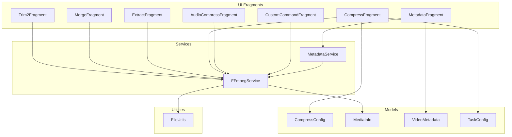

**Diagram sources**
- [FFmpegService.kt:19-420](file://app/src/main/java/com/pisces312/streamclip/service/FFmpegService.kt#L19-L420)
- [CompressConfig.kt:1-209](file://app/src/main/java/com/pisces312/streamclip/model/CompressConfig.kt#L1-L209)
- [MediaInfo.kt:1-165](file://app/src/main/java/com/pisces312/streamclip/model/MediaInfo.kt#L1-L165)
- [VideoMetadata.kt:1-56](file://app/src/main/java/com/pisces312/streamclip/model/VideoMetadata.kt#L1-L56)
- [MetadataService.kt:1-93](file://app/src/main/java/com/pisces312/streamclip/service/MetadataService.kt#L1-L93)
- [FileUtils.kt:1-362](file://app/src/main/java/com/pisces312/streamclip/util/FileUtils.kt#L1-L362)
- [Trim2Fragment.kt:1-286](file://app/src/main/java/com/pisces312/streamclip/fragment/Trim2Fragment.kt#L1-L286)
- [MergeFragment.kt:1-278](file://app/src/main/java/com/pisces312/streamclip/fragment/MergeFragment.kt#L1-L278)
- [ExtractFragment.kt:1-209](file://app/src/main/java/com/pisces312/streamclip/fragment/ExtractFragment.kt#L1-L209)
- [CompressFragment.kt:1-839](file://app/src/main/java/com/pisces312/streamclip/fragment/CompressFragment.kt#L1-L839)
- [AudioCompressFragment.kt:1-417](file://app/src/main/java/com/pisces312/streamclip/fragment/AudioCompressFragment.kt#L1-L417)
- [CustomCommandFragment.kt:1-331](file://app/src/main/java/com/pisces312/streamclip/fragment/CustomCommandFragment.kt#L1-L331)
- [MetadataFragment.kt:1-224](file://app/src/main/java/com/pisces312/streamclip/fragment/MetadataFragment.kt#L1-L224)
- [TaskConfig.kt:1-15](file://app/src/main/java/com/pisces312/streamclip/model/TaskConfig.kt#L1-L15)

**Section sources**
- [FFmpegService.kt:19-420](file://app/src/main/java/com/pisces312/streamclip/service/FFmpegService.kt#L19-L420)
- [CompressConfig.kt:1-209](file://app/src/main/java/com/pisces312/streamclip/model/CompressConfig.kt#L1-L209)
- [MediaInfo.kt:1-165](file://app/src/main/java/com/pisces312/streamclip/model/MediaInfo.kt#L1-L165)
- [VideoMetadata.kt:1-56](file://app/src/main/java/com/pisces312/streamclip/model/VideoMetadata.kt#L1-L56)
- [MetadataService.kt:1-93](file://app/src/main/java/com/pisces312/streamclip/service/MetadataService.kt#L1-L93)
- [FileUtils.kt:1-362](file://app/src/main/java/com/pisces312/streamclip/util/FileUtils.kt#L1-L362)
- [Trim2Fragment.kt:1-286](file://app/src/main/java/com/pisces312/streamclip/fragment/Trim2Fragment.kt#L1-L286)
- [MergeFragment.kt:1-278](file://app/src/main/java/com/pisces312/streamclip/fragment/MergeFragment.kt#L1-L278)
- [ExtractFragment.kt:1-209](file://app/src/main/java/com/pisces312/streamclip/fragment/ExtractFragment.kt#L1-L209)
- [CompressFragment.kt:1-839](file://app/src/main/java/com/pisces312/streamclip/fragment/CompressFragment.kt#L1-L839)
- [AudioCompressFragment.kt:1-417](file://app/src/main/java/com/pisces312/streamclip/fragment/AudioCompressFragment.kt#L1-L417)
- [CustomCommandFragment.kt:1-331](file://app/src/main/java/com/pisces312/streamclip/fragment/CustomCommandFragment.kt#L1-L331)
- [MetadataFragment.kt:1-224](file://app/src/main/java/com/pisces312/streamclip/fragment/MetadataFragment.kt#L1-L224)
- [TaskConfig.kt:1-15](file://app/src/main/java/com/pisces312/streamclip/model/TaskConfig.kt#L1-L15)

## Core Components
- FFmpegService: Centralized execution engine for FFmpeg/FFprobe commands, progress tracking, and cancellation. Provides lossless trim, merge, audio extract, video/audio compression, and generic command execution.
- CompressConfig: Encapsulates encoding parameters (hardware/software, bitrate/CRF, resolution scaling, frame rate, audio settings) and builds FFmpeg commands.
- MediaInfo: Parses ffprobe JSON to expose media properties and compatibility checks for merging.
- VideoMetadata and MetadataService: Read/write metadata tags using FFmpeg’s -metadata/-map_metadata for lossless edits.
- FileUtils: Resolves URIs to real paths, copies to cache when needed, scans files, and preserves timestamps.

**Section sources**
- [FFmpegService.kt:19-420](file://app/src/main/java/com/pisces312/streamclip/service/FFmpegService.kt#L19-L420)
- [CompressConfig.kt:1-209](file://app/src/main/java/com/pisces312/streamclip/model/CompressConfig.kt#L1-L209)
- [MediaInfo.kt:1-165](file://app/src/main/java/com/pisces312/streamclip/model/MediaInfo.kt#L1-L165)
- [VideoMetadata.kt:1-56](file://app/src/main/java/com/pisces312/streamclip/model/VideoMetadata.kt#L1-L56)
- [MetadataService.kt:1-93](file://app/src/main/java/com/pisces312/streamclip/service/MetadataService.kt#L1-L93)
- [FileUtils.kt:1-362](file://app/src/main/java/com/pisces312/streamclip/util/FileUtils.kt#L1-L362)

## Architecture Overview
The UI fragments trigger operations by invoking FFmpegService methods. FFmpegService executes commands asynchronously, reporting progress via StatisticsCallback and logs via log callback. Results are returned through a Result object. Specialized services (e.g., MetadataService) wrap FFmpegService for domain-specific workflows.

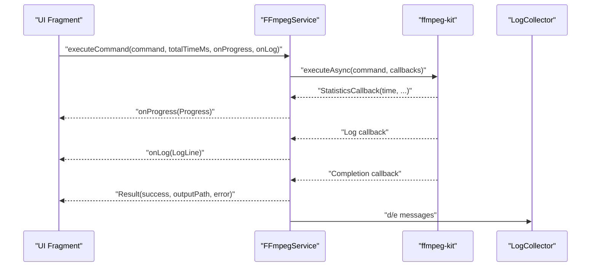

**Diagram sources**
- [FFmpegService.kt:152-241](file://app/src/main/java/com/pisces312/streamclip/service/FFmpegService.kt#L152-L241)

**Section sources**
- [FFmpegService.kt:152-241](file://app/src/main/java/com/pisces312/streamclip/service/FFmpegService.kt#L152-L241)

## Detailed Component Analysis

### Lossless Trimming (Stream Copy)
- Principle: Uses -c copy to avoid re-encoding, preserving quality and speed. Applies -ss and -t to select segment; -avoid_negative_ts and -fflags genpts stabilize timestamps.
- Quality: No quality loss; exact frame copy.
- Performance: Near-instantaneous for supported containers; CPU negligible; I/O bound.
- Parameters: start time, duration, output container (MOV for metadata preservation).
- Implementation highlights:
  - Command building and execution in FFmpegService.trimVideo
  - UI fragment constructs start/duration from slider and calls trimVideo
  - Progress callback not used because trim is near-instant
  - Timestamps preserved post-operation

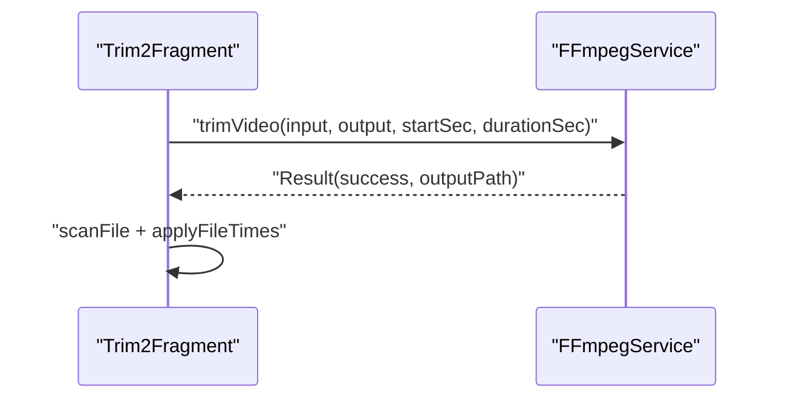

**Diagram sources**
- [FFmpegService.kt:246-272](file://app/src/main/java/com/pisces312/streamclip/service/FFmpegService.kt#L246-L272)
- [Trim2Fragment.kt:178-251](file://app/src/main/java/com/pisces312/streamclip/fragment/Trim2Fragment.kt#L178-L251)

**Section sources**
- [FFmpegService.kt:246-272](file://app/src/main/java/com/pisces312/streamclip/service/FFmpegService.kt#L246-L272)
- [Trim2Fragment.kt:178-251](file://app/src/main/java/com/pisces312/streamclip/fragment/Trim2Fragment.kt#L178-L251)

### Video Merging (Concat Demuxer, Lossless)
- Principle: Concat demuxer concatenates multiple inputs without re-encoding. Requires compatible streams; metadata from first input is applied to merged output.
- Quality: No quality loss; exact stream copy.
- Performance: Fast; depends on I/O throughput.
- Parameters: Input file list; compatibility checked via MediaInfo.
- Implementation highlights:
  - FFmpegService.mergeVideos writes a concat list file and runs concat demuxer
  - Metadata from first video is extracted and reapplied to output
  - UI fragment validates compatibility and triggers merge

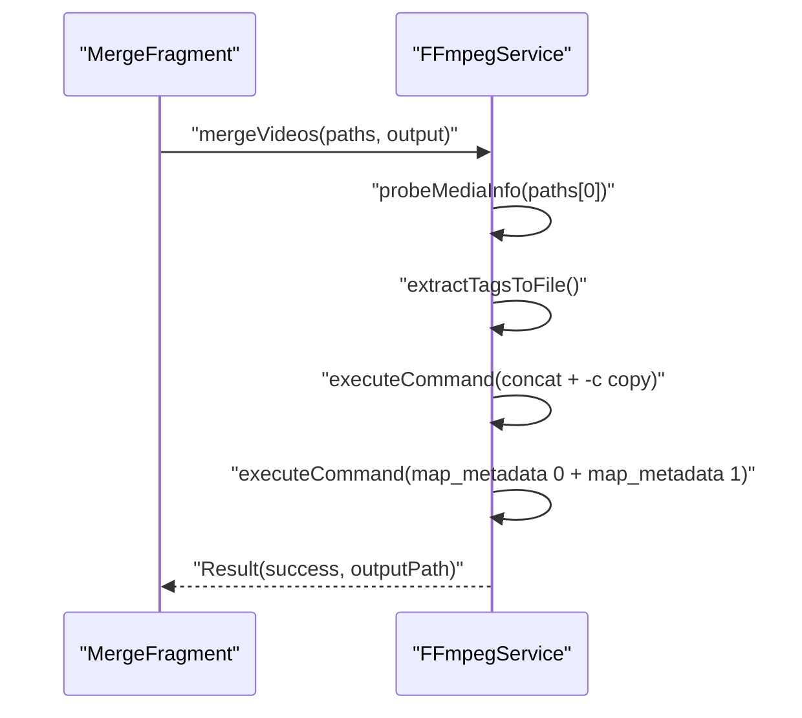

**Diagram sources**
- [FFmpegService.kt:297-334](file://app/src/main/java/com/pisces312/streamclip/service/FFmpegService.kt#L297-L334)
- [MergeFragment.kt:135-232](file://app/src/main/java/com/pisces312/streamclip/fragment/MergeFragment.kt#L135-L232)

**Section sources**
- [FFmpegService.kt:297-334](file://app/src/main/java/com/pisces312/streamclip/service/FFmpegService.kt#L297-L334)
- [MergeFragment.kt:135-232](file://app/src/main/java/com/pisces312/streamclip/fragment/MergeFragment.kt#L135-L232)

### Audio Extraction (Lossless)
- Principle: Copies audio track (-c:a copy) and strips video (-vn) to produce an audio file.
- Quality: No quality loss.
- Performance: Fast; container-dependent.
- Parameters: Input video, output audio path.
- Implementation highlights:
  - FFmpegService.extractAudio builds and executes the command
  - UI fragment probes media info to display audio details and selects output extension

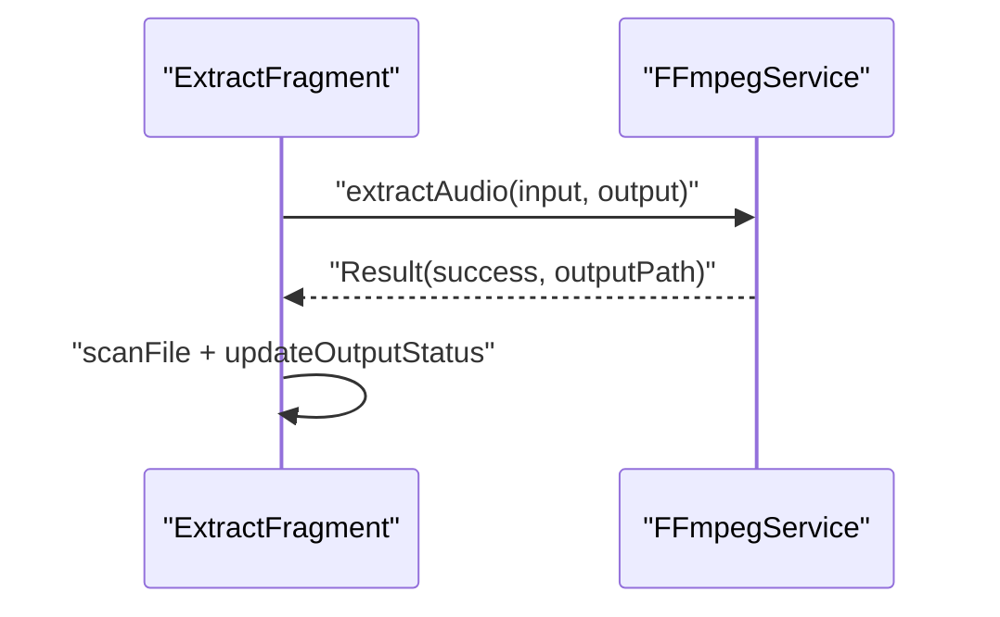

**Diagram sources**
- [FFmpegService.kt:339-350](file://app/src/main/java/com/pisces312/streamclip/service/FFmpegService.kt#L339-L350)
- [ExtractFragment.kt:136-191](file://app/src/main/java/com/pisces312/streamclip/fragment/ExtractFragment.kt#L136-L191)

**Section sources**
- [FFmpegService.kt:339-350](file://app/src/main/java/com/pisces312/streamclip/service/FFmpegService.kt#L339-L350)
- [ExtractFragment.kt:136-191](file://app/src/main/java/com/pisces312/streamclip/fragment/ExtractFragment.kt#L136-L191)

### Hardware Compression (HEVC MediaCodec)
- Principle: Uses Android hardware encoder (hevc_mediacodec) with bitrate control and buffer sizing. Maintains metadata and applies color metadata via container flags for HDR/S DR.
- Quality: Variable depending on bitrate; HDR requires main10 profile and container flags.
- Performance: Fast; leverages device GPU/ISP.
- Parameters: Encoder, bitrate, resolution scaling, frame rate, audio encoder/bitrate/sample rate.
- Implementation highlights:
  - FFmpegService.compressVideo builds command with bitrate/bufsize and scale filter
  - CompressConfig.toFFmpegCommand centralizes parameterization and HDR handling
  - UI fragments present hardware/software tabs and collect user choices

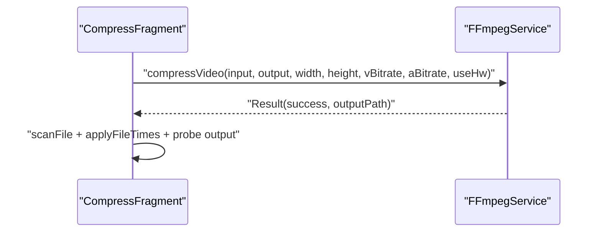

**Diagram sources**
- [FFmpegService.kt:355-393](file://app/src/main/java/com/pisces312/streamclip/service/FFmpegService.kt#L355-L393)
- [CompressConfig.kt:21-114](file://app/src/main/java/com/pisces312/streamclip/model/CompressConfig.kt#L21-L114)
- [CompressFragment.kt:572-680](file://app/src/main/java/com/pisces312/streamclip/fragment/CompressFragment.kt#L572-L680)

**Section sources**
- [FFmpegService.kt:355-393](file://app/src/main/java/com/pisces312/streamclip/service/FFmpegService.kt#L355-L393)
- [CompressConfig.kt:21-114](file://app/src/main/java/com/pisces312/streamclip/model/CompressConfig.kt#L21-L114)
- [CompressFragment.kt:572-680](file://app/src/main/java/com/pisces312/streamclip/fragment/CompressFragment.kt#L572-L680)

### Software Compression (x264/x265)
- Principle: Uses libx264/libx265 with CRF and preset controls. Supports HDR via pixel format and color metadata flags.
- Quality: Deterministic quality via CRF; slower but more flexible.
- Performance: CPU-intensive; duration proportional to input length.
- Parameters: CRF, preset, resolution scaling, frame rate, audio settings.
- Implementation highlights:
  - FFmpegService.compressVideo supports software path with tune/ssim and preset
  - UI fragment collects CRF/preset and passes to command builder

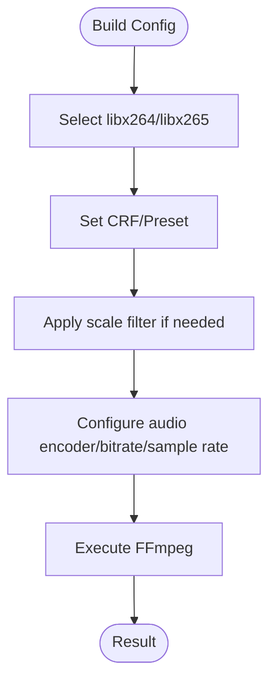

**Diagram sources**
- [FFmpegService.kt:355-393](file://app/src/main/java/com/pisces312/streamclip/service/FFmpegService.kt#L355-L393)
- [CompressConfig.kt:21-114](file://app/src/main/java/com/pisces312/streamclip/model/CompressConfig.kt#L21-L114)

**Section sources**
- [FFmpegService.kt:355-393](file://app/src/main/java/com/pisces312/streamclip/service/FFmpegService.kt#L355-L393)
- [CompressConfig.kt:21-114](file://app/src/main/java/com/pisces312/streamclip/model/CompressConfig.kt#L21-L114)

### Audio Compression (Re-encode)
- Principle: Re-encodes audio to target bitrate/sample rate while copying video tracks.
- Quality: Depends on chosen audio encoder/bitrate.
- Performance: Moderate; CPU-bound for audio processing.
- Parameters: Audio encoder, bitrate, sample rate.
- Implementation highlights:
  - FFmpegService.compressAudio builds command and reports progress
  - UI fragment displays original audio info and handles output naming

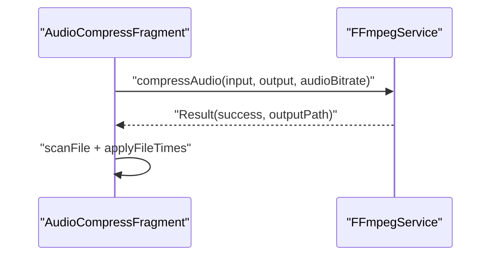

**Diagram sources**
- [FFmpegService.kt:398-418](file://app/src/main/java/com/pisces312/streamclip/service/FFmpegService.kt#L398-L418)
- [AudioCompressFragment.kt:225-345](file://app/src/main/java/com/pisces312/streamclip/fragment/AudioCompressFragment.kt#L225-L345)

**Section sources**
- [FFmpegService.kt:398-418](file://app/src/main/java/com/pisces312/streamclip/service/FFmpegService.kt#L398-L418)
- [AudioCompressFragment.kt:225-345](file://app/src/main/java/com/pisces312/streamclip/fragment/AudioCompressFragment.kt#L225-L345)

### Custom FFmpeg Command Execution
- Principle: Executes arbitrary FFmpeg/FFprobe commands with progress/log dialogs. Parses input/output paths to estimate progress.
- Quality: Depends on provided command.
- Performance: Varies; progress estimation uses parsed duration.
- Parameters: Command string, type (FFmpeg/FFprobe), optional output path.
- Implementation highlights:
  - FFmpegService.executeCommand supports async execution with callbacks
  - UI fragment parses -i and final argument to infer input/output
  - Dialog shows logs, progress, and allows cancellation

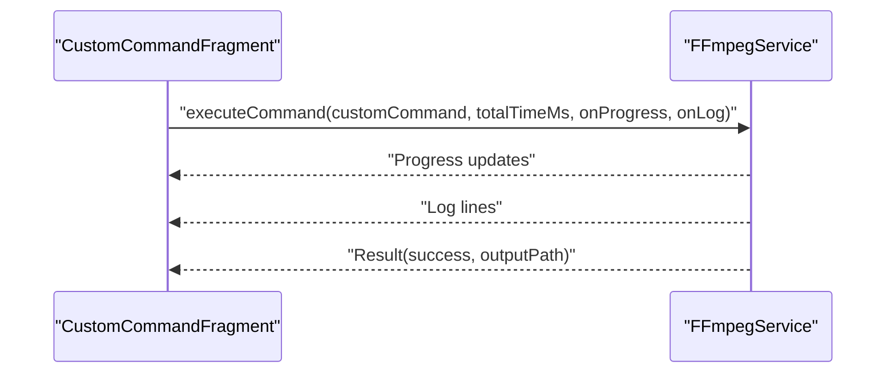

**Diagram sources**
- [FFmpegService.kt:152-241](file://app/src/main/java/com/pisces312/streamclip/service/FFmpegService.kt#L152-L241)
- [CustomCommandFragment.kt:89-204](file://app/src/main/java/com/pisces312/streamclip/fragment/CustomCommandFragment.kt#L89-L204)

**Section sources**
- [FFmpegService.kt:152-241](file://app/src/main/java/com/pisces312/streamclip/service/FFmpegService.kt#L152-L241)
- [CustomCommandFragment.kt:89-204](file://app/src/main/java/com/pisces312/streamclip/fragment/CustomCommandFragment.kt#L89-L204)

### Metadata Manipulation (Lossless Edit)
- Principle: Reads tags via FFmpegService.probeMediaInfo, computes changed fields, and writes only those tags using -metadata with -c copy to avoid re-encoding.
- Quality: No re-encoding; preserves original streams.
- Performance: Very fast; disk I/O dependent.
- Parameters: Title, artist, creation_time, location, comment.
- Implementation highlights:
  - MetadataService.saveMetadata builds -metadata arguments for changed fields
  - UI fragment populates fields from VideoMetadata and saves only differences

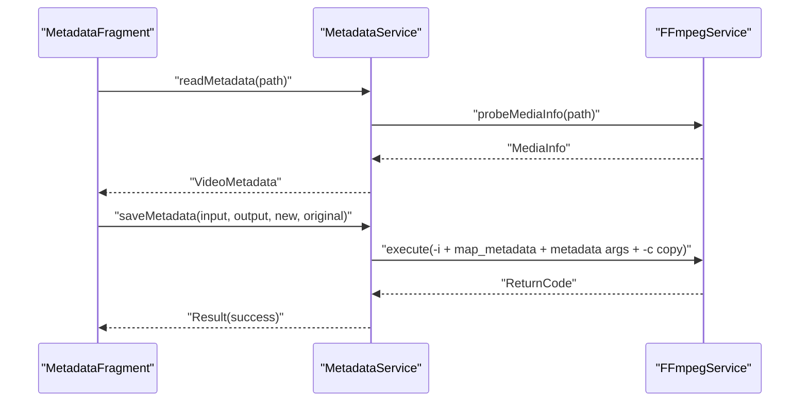

**Diagram sources**
- [MetadataService.kt:14-67](file://app/src/main/java/com/pisces312/streamclip/service/MetadataService.kt#L14-L67)
- [FFmpegService.kt:56-147](file://app/src/main/java/com/pisces312/streamclip/service/FFmpegService.kt#L56-L147)
- [VideoMetadata.kt:22-41](file://app/src/main/java/com/pisces312/streamclip/model/VideoMetadata.kt#L22-L41)
- [MetadataFragment.kt:85-210](file://app/src/main/java/com/pisces312/streamclip/fragment/MetadataFragment.kt#L85-L210)

**Section sources**
- [MetadataService.kt:14-67](file://app/src/main/java/com/pisces312/streamclip/service/MetadataService.kt#L14-L67)
- [FFmpegService.kt:56-147](file://app/src/main/java/com/pisces312/streamclip/service/FFmpegService.kt#L56-L147)
- [VideoMetadata.kt:22-41](file://app/src/main/java/com/pisces312/streamclip/model/VideoMetadata.kt#L22-L41)
- [MetadataFragment.kt:85-210](file://app/src/main/java/com/pisces312/streamclip/fragment/MetadataFragment.kt#L85-L210)

## Dependency Analysis
- UI fragments depend on FFmpegService for all FFmpeg operations and on FileUtils for path resolution and file scanning.
- CompressFragment and AudioCompressFragment depend on CompressConfig to build commands.
- MergeFragment depends on MediaInfo for compatibility checks.
- MetadataFragment depends on MetadataService, which depends on FFmpegService for probing/saving.
- TaskConfig bridges CompressConfig to batch processing.

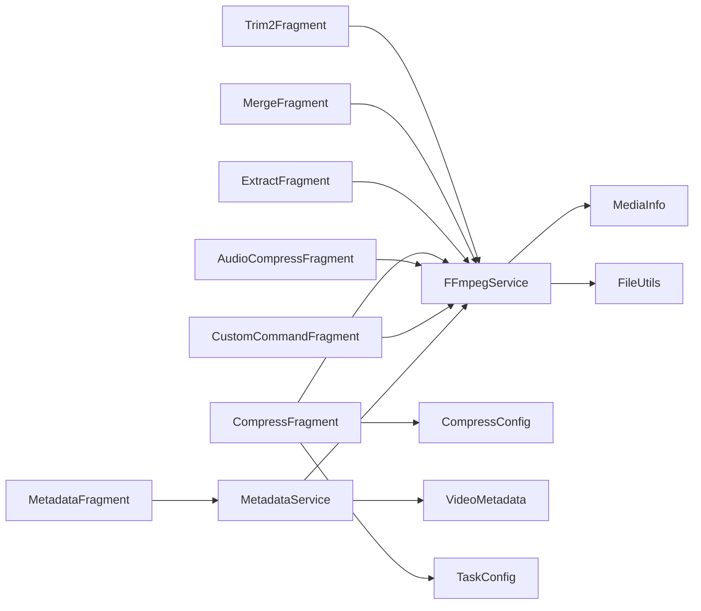

**Diagram sources**
- [Trim2Fragment.kt:1-286](file://app/src/main/java/com/pisces312/streamclip/fragment/Trim2Fragment.kt#L1-L286)
- [MergeFragment.kt:1-278](file://app/src/main/java/com/pisces312/streamclip/fragment/MergeFragment.kt#L1-L278)
- [ExtractFragment.kt:1-209](file://app/src/main/java/com/pisces312/streamclip/fragment/ExtractFragment.kt#L1-L209)
- [CompressFragment.kt:1-839](file://app/src/main/java/com/pisces312/streamclip/fragment/CompressFragment.kt#L1-L839)
- [AudioCompressFragment.kt:1-417](file://app/src/main/java/com/pisces312/streamclip/fragment/AudioCompressFragment.kt#L1-L417)
- [CustomCommandFragment.kt:1-331](file://app/src/main/java/com/pisces312/streamclip/fragment/CustomCommandFragment.kt#L1-L331)
- [MetadataFragment.kt:1-224](file://app/src/main/java/com/pisces312/streamclip/fragment/MetadataFragment.kt#L1-L224)
- [FFmpegService.kt:19-420](file://app/src/main/java/com/pisces312/streamclip/service/FFmpegService.kt#L19-L420)
- [CompressConfig.kt:1-209](file://app/src/main/java/com/pisces312/streamclip/model/CompressConfig.kt#L1-L209)
- [MediaInfo.kt:1-165](file://app/src/main/java/com/pisces312/streamclip/model/MediaInfo.kt#L1-L165)
- [VideoMetadata.kt:1-56](file://app/src/main/java/com/pisces312/streamclip/model/VideoMetadata.kt#L1-L56)
- [MetadataService.kt:1-93](file://app/src/main/java/com/pisces312/streamclip/service/MetadataService.kt#L1-L93)
- [FileUtils.kt:1-362](file://app/src/main/java/com/pisces312/streamclip/util/FileUtils.kt#L1-L362)
- [TaskConfig.kt:1-15](file://app/src/main/java/com/pisces312/streamclip/model/TaskConfig.kt#L1-L15)

**Section sources**
- [FFmpegService.kt:19-420](file://app/src/main/java/com/pisces312/streamclip/service/FFmpegService.kt#L19-L420)
- [CompressConfig.kt:1-209](file://app/src/main/java/com/pisces312/streamclip/model/CompressConfig.kt#L1-L209)
- [MediaInfo.kt:1-165](file://app/src/main/java/com/pisces312/streamclip/model/MediaInfo.kt#L1-L165)
- [VideoMetadata.kt:1-56](file://app/src/main/java/com/pisces312/streamclip/model/VideoMetadata.kt#L1-L56)
- [MetadataService.kt:1-93](file://app/src/main/java/com/pisces312/streamclip/service/MetadataService.kt#L1-L93)
- [FileUtils.kt:1-362](file://app/src/main/java/com/pisces312/streamclip/util/FileUtils.kt#L1-L362)
- [TaskConfig.kt:1-15](file://app/src/main/java/com/pisces312/streamclip/model/TaskConfig.kt#L1-L15)

## Performance Considerations
- Lossless operations (trim, merge, extract, metadata edit) are I/O bound and fast; CPU overhead minimal.
- Hardware compression is fastest but may vary by device; bitrate directly impacts output size.
- Software compression is slower but offers finer control (CRF/preset); tune/ssim improves perceived quality.
- Progress estimation relies on total duration; unknown durations yield -1 percent.
- HDR handling requires container-level flags; some players read container nclx rather than bitstream VUI.

[No sources needed since this section provides general guidance]

## Troubleshooting Guide
Common issues and remedies:
- Trim fails with “Unknown error”: Verify input path resolution via FileUtils and container compatibility.
- Merge fails with “MERGE_NEED_2” or incompatible params: Ensure at least two files and identical streams (resolution, codec, framerate, pixel format, rotation).
- Extract produces unsupported format: Use extension inferred from audio codec via MediaInfo.
- Compression stalls or crashes: Reduce bitrate/CPU load; switch presets; confirm audio sample rate compatibility to avoid resample crashes.
- Metadata save fails: Ensure at least one field changed; verify -c copy succeeds.
- Custom command hangs: Cancel via dialog; ensure valid -i and output path parsing.

**Section sources**
- [MergeFragment.kt:135-232](file://app/src/main/java/com/pisces312/streamclip/fragment/MergeFragment.kt#L135-L232)
- [ExtractFragment.kt:136-191](file://app/src/main/java/com/pisces312/streamclip/fragment/ExtractFragment.kt#L136-L191)
- [CompressFragment.kt:572-680](file://app/src/main/java/com/pisces312/streamclip/fragment/CompressFragment.kt#L572-L680)
- [MetadataService.kt:34-67](file://app/src/main/java/com/pisces312/streamclip/service/MetadataService.kt#L34-L67)
- [CustomCommandFragment.kt:89-204](file://app/src/main/java/com/pisces312/streamclip/fragment/CustomCommandFragment.kt#L89-L204)

## Conclusion
StreamClip’s eight core operations leverage ffmpeg-kit for robust, cross-platform video processing. Lossless operations preserve quality and maximize speed, while hardware/software compression balances performance and control. Metadata edits remain lossless by copying streams and updating tags. The UI fragments cleanly separate concerns from FFmpegService, enabling reliable progress tracking, logging, and cancellation. Following the parameter configurations and troubleshooting tips ensures predictable outcomes across diverse devices and media types.